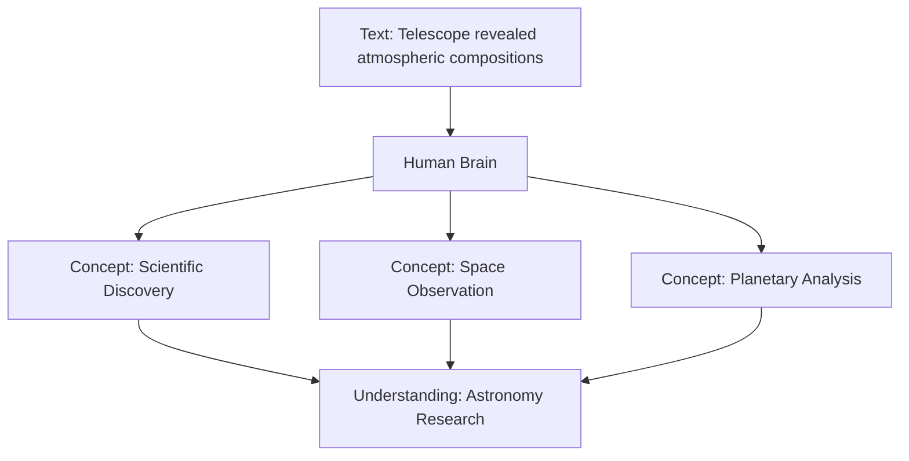
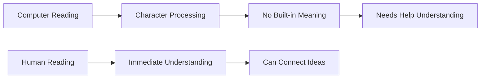
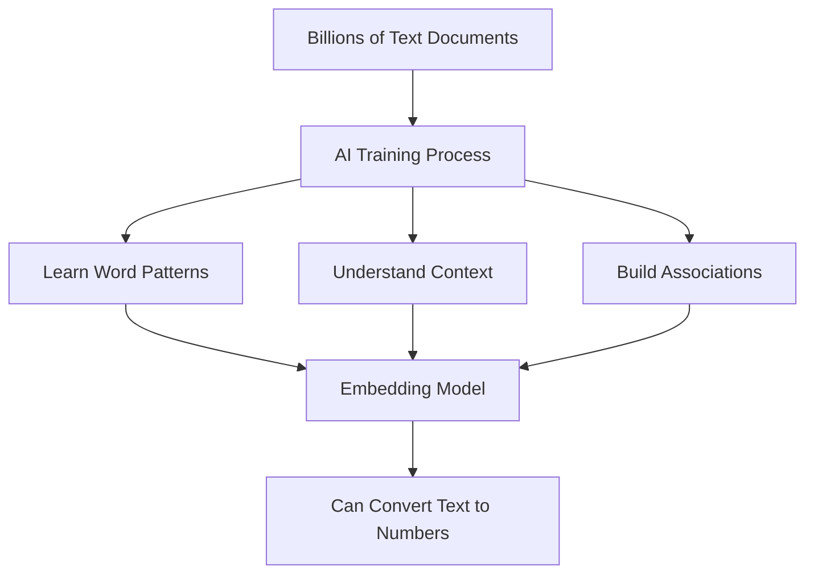
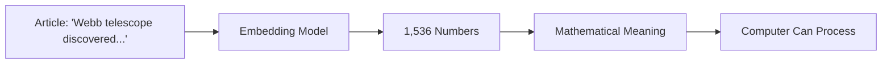
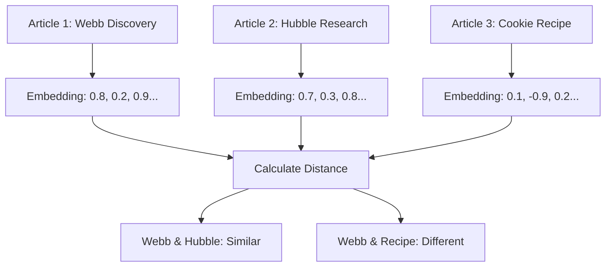
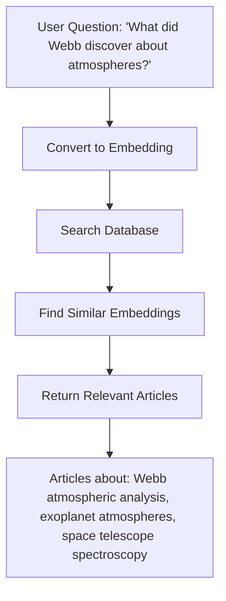
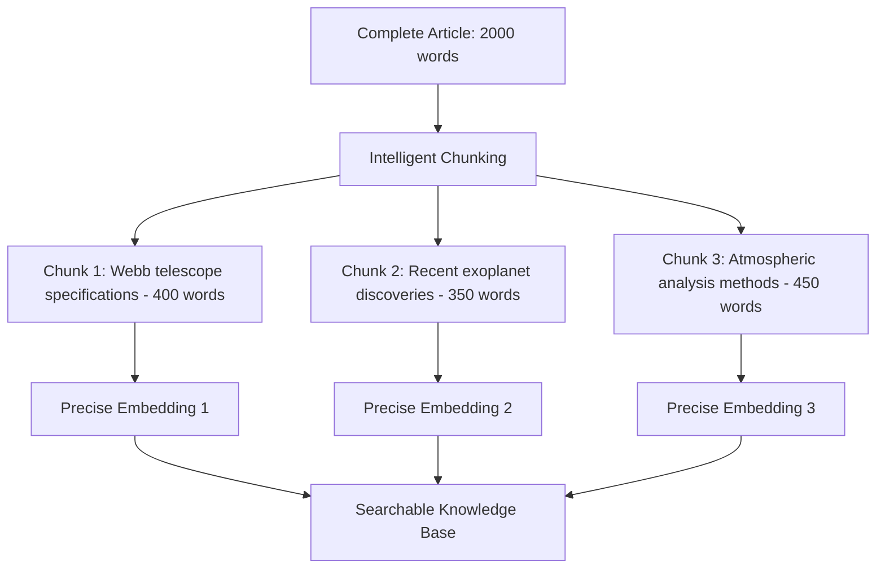
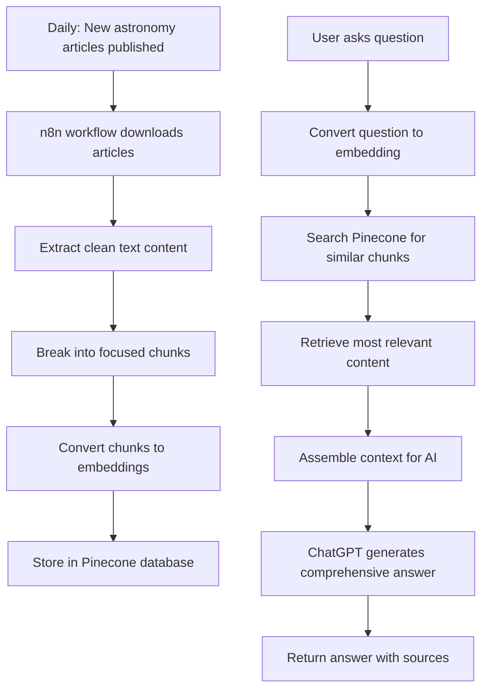
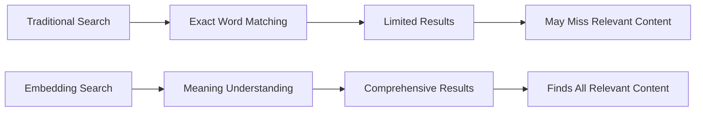
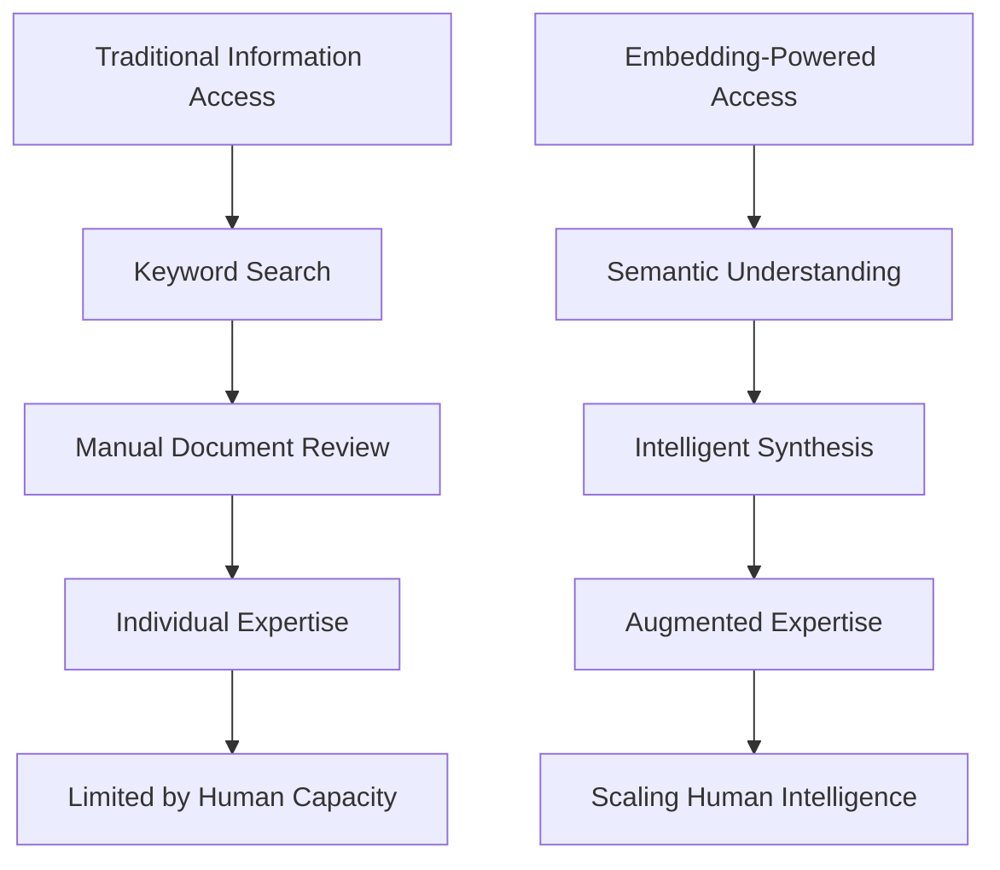

> **AI-Generated Content Disclaimer**
> 
> This document was created using Anthropic Claude Sonnet 4 and may contain factual errors or outdated information. While care has been taken to minimize inaccuracies and verify information against official sources, all facts, pricing, and technical details should be independently verified using the source links provided throughout this document.
> 
> Please check official platform websites and documentation before making business decisions based on this content.

# Understanding Text Embeddings: From Words to Meaning

*How the astronomy workflows transform text into intelligent, searchable knowledge*

[Back to TOC](./README.md#table-of-contents)

## The Problem We're Solving

Imagine you work at a research institution and need to stay current with astronomy discoveries. Every day, dozens of new articles are published. A colleague asks you: *"What has the James Webb telescope discovered about exoplanet atmospheres?"*

You face several challenges:
- **Volume**: Too many articles to read everything
- **Terminology**: Articles use different words for similar concepts  
- **Connections**: Related discoveries might be scattered across different papers
- **Recency**: You need the latest findings, not outdated information

Traditional computer search doesn't help much. If you search for "Webb telescope exoplanets," you'll only find articles containing those exact words. You might miss papers that discuss "JWST atmospheric analysis" or "space telescope planetary observations."

**This is where text embeddings come in - they teach computers to understand meaning, not just match words.**

## Building Understanding: From Simple to Complex

### Step 1: How Humans Understand Meaning

Before we dive into the technology, let's think about how you understand language.

When you read "The telescope revealed surprising atmospheric compositions," your brain instantly:
- Recognizes "telescope" relates to observation and astronomy
- Understands "revealed" means discovery
- Connects "atmospheric compositions" to planets and scientific analysis
- Forms a mental picture of scientific discovery

You do this because you've learned that certain concepts relate to each other. Text embeddings teach computers to make these same connections.

### Step 2: The Computer's Challenge

Computers naturally see text very differently:

**What you see**: "The telescope revealed surprising atmospheric compositions"
**What computers see**: `['T','h','e',' ','t','e','l','e','s','c','o','p','e'...]`

Computers excel at processing individual characters and exact matches, but they don't inherently understand that:
- "telescope" and "observatory" mean similar things
- "revealed" and "discovered" convey the same idea
- "atmospheric compositions" relates to "planetary science"

### Step 3: Teaching Computers About Meaning

Text embeddings solve this by creating a "meaning translator" that converts human language into mathematical representations computers can work with.

Here's the breakthrough insight: **If we can represent meaning as numbers, computers can do math with meaning.**

## The Embedding Process: Step by Step

### Stage 1: Training the Translation Model

Before our system can understand astronomy articles, it needs to learn language itself. [OpenAI's embedding model](https://www.pinecone.io/learn/vector-embeddings-for-developers/) was trained by:

1. **Reading billions of documents** - web pages, books, articles, research papers
2. **Learning word relationships** - noticing that "telescope" often appears near "observation," "stars," "discovery"
3. **Understanding context** - recognizing that "mars" in astronomy articles refers to a planet, not the candy bar
4. **Building associations** - connecting "exoplanet," "distant world," and "extrasolar planet" as related concepts

Think of this like teaching someone a new language by having them read an entire library, paying attention to how words are used together.

### Stage 2: Converting Text to Mathematical Coordinates

When our system encounters an astronomy article, the embedding model performs this transformation:

**Input text**: *"The James Webb Space Telescope has identified water vapor in the atmosphere of exoplanet K2-18 b"*

**Output**: A list of 1,536 numbers: `[0.23, -0.11, 0.84, 0.05, -0.32, ...]`

Each number represents different aspects of meaning:
- Some numbers might encode "space-related content" 
- Others might represent "scientific discovery"
- Still others capture "telescope observations"

Think of these numbers as GPS coordinates, but instead of locating something on Earth, they locate the text's meaning in "concept space."

### Stage 3: The Power of Mathematical Similarity

Here's where it gets powerful. Since meanings are now numbers, we can calculate how similar any two pieces of text are by comparing their number lists.

**Similar articles get similar numbers**:
- Webb telescope article: `[0.8, 0.2, 0.9, ...]`
- Hubble telescope article: `[0.7, 0.3, 0.8, ...]` ← Close numbers!
- Cooking recipe: `[0.1, -0.9, 0.2, ...]` ← Very different numbers

The computer can calculate mathematical "distance" between these number lists to determine similarity.

## From Understanding to Intelligent Search

### The Traditional Search Problem

Old-fashioned search works like a simple filing system - it looks for exact word matches:

- Search "telescope" → finds articles containing the word "telescope"
- Search "observatory" → misses telescope articles entirely  
- Search "What did Webb discover?" → finds nothing (no article contains this exact phrase)

This creates frustration when you know relevant information exists but can't find it because you're not using the exact terminology the authors used.

### The Embedding Solution

With embeddings, search becomes like consulting a knowledgeable colleague who understands what you're really asking about:

**The magic**: The system finds relevant content even when articles use completely different words than your question.

### Real Example in Action

Let's trace through a real search:

**User asks**: *"How does Webb compare to Hubble?"*

**Traditional keyword search would find**: Articles containing both "Webb" AND "Hubble" AND "compare" - probably very few results.

**Embedding search finds**:
1. Articles discussing Webb's infrared capabilities vs Hubble's visible light
2. Papers comparing space telescope technologies across generations  
3. Research highlighting Webb's deeper space observation abilities
4. Analysis of image quality differences between the telescopes

**Why this works**: The embedding model learned that telescope comparison involves discussing capabilities, technologies, image quality, and observational differences - even when articles don't explicitly use the word "compare."

## The Chunking Strategy: Managing Information Overload

### The Problem with Whole Articles

Imagine trying to describe an entire encyclopedia with just one address. You'd end up with something so general it doesn't help you find any specific information.

Similarly, converting a complete 2,000-word astronomy article into a single embedding creates a "blurry" representation that might miss important details buried in the middle.

### The Solution: Strategic Chunking

Our system intelligently breaks articles into focused segments:

**Benefits of chunking**:
- **Precision**: Each chunk focuses on specific concepts
- **Relevance**: Search results match exactly what the user needs
- **Context preservation**: Maintains connection to original article
- **Flexibility**: Can combine multiple chunks to answer complex questions

## The RAG Process: Putting It All Together

RAG stands for "Retrieval-Augmented Generation" - essentially, "find relevant information, then generate an intelligent answer."

### The Complete Journey

Let's follow a user question through the entire system:

### Detailed Step-by-Step Process

**1. Knowledge Acquisition** (happens automatically daily)
- n8n workflow monitors Phys.org RSS feeds
- Downloads new astronomy articles  
- Extracts clean text from web pages
- Breaks articles into meaningful chunks (300-800 words each)
- Converts each chunk to 1,536-dimensional embeddings using OpenAI
- Stores embeddings with metadata in Pinecone vector database

**2. User Interaction** (happens when someone asks a question)
- User asks: *"What are the latest discoveries about black holes?"*
- System converts question into embedding using same OpenAI model

**3. Intelligent Retrieval**
- Searches Pinecone database for chunks with embeddings similar to the question
- Ranks results by similarity score (0.8+ indicates high relevance)
- Retrieves top 10 most relevant chunks from recent articles

**4. Context Assembly**
- Gathers selected chunks with their source information
- Includes article titles, publication dates, and URLs
- Formats comprehensive context for AI processing

**5. Intelligent Response Generation**
- Sends question + relevant chunks to ChatGPT
- AI synthesizes information from multiple sources
- Generates coherent answer citing specific articles
- Returns response with source attribution to user

### Why This Approach Works

**Traditional chatbot limitation**: *"I was trained on data up to 2023, so I don't know about recent black hole discoveries."*

**RAG-powered response**: *"Based on three articles published this week on Phys.org, astronomers have discovered a supermassive black hole that challenges current formation theories. The Event Horizon Telescope team reported... [continues with specific, current information]"*

The system combines the reasoning capabilities of large language models with up-to-date, domain-specific knowledge from authoritative sources.

## Real-World Impact and Applications

### For Different Types of Users

**Research Scientists**:
- Quickly find papers using natural language queries
- Discover connections between different research areas
- Stay current with rapidly evolving fields
- Cross-reference findings across multiple studies

**Science Educators**:
- Get complex topics explained at appropriate levels
- Find current examples to illustrate scientific principles
- Access source materials for lesson planning
- Answer student questions with confidence

**Science Communicators**:
- Find compelling recent discoveries for articles
- Understand technical concepts for general audience translation
- Access credible sources for fact-checking
- Identify trending topics in astronomy

**Curious Public**:
- Ask questions in plain English without technical jargon
- Get expert-level answers from authoritative sources
- Follow interest-driven exploration paths
- Learn about cutting-edge discoveries as they happen

### Advantages Over Traditional Methods

**Traditional academic search**:
- Requires knowing exact terminology
- Misses papers using different vocabulary
- Can't synthesize information across sources
- Often returns too many or too few results

**Embedding-powered search**:
- Understands what you're really asking about
- Finds relevant content regardless of word choice
- Synthesizes findings from multiple sources
- Provides contextual, comprehensive answers

## Technical Implementation: The Engine Behind the Magic

### The Technology Stack

Our astronomy workflows rely on several sophisticated technologies working together:

**OpenAI Embedding Model (text-embedding-3-small)**[^1]:
- Converts text into 1,536-dimensional numerical vectors
- Trained on diverse internet text to understand scientific language
- Processes up to 8,191 tokens (roughly 6,000 words) per request
- Optimized for semantic similarity tasks

**Pinecone Vector Database**[^2]:
- Specialized storage for high-dimensional embedding vectors  
- Enables millisecond search across millions of embeddings
- Scales automatically as the knowledge base grows
- Maintains accuracy and speed with large datasets

**n8n Workflow Orchestration**:
- Automates daily article collection and processing
- Manages API interactions with OpenAI and Pinecone
- Handles error recovery and rate limiting
- Provides visual workflow management interface

### Performance Characteristics

**Reliability**: Automated error handling and retry mechanisms
**Cost-efficiency**: Optimized to minimize API usage while maintaining quality

*Note: Actual search speed, accuracy scores, and scale depend on database configuration, article volume, query complexity, and infrastructure setup.*

## Understanding the Limitations

### What Embeddings Excel At

**Semantic Understanding**:
- Recognizing that "red planet" refers to Mars
- Understanding "space telescope" encompasses Webb, Hubble, and others
- Connecting "atmospheric analysis" with "exoplanet research"

**Cross-terminology Bridging**:
- Finding "galaxy" articles when searching for "stellar systems"
- Connecting "extrasolar planets" with "exoplanet" searches
- Understanding acronyms and full names (JWST ↔ James Webb Space Telescope)

**Conceptual Relationships**:
- Linking telescope technology with observational capabilities
- Connecting theoretical predictions with observational confirmations
- Understanding hierarchical relationships (galaxies contain stars contain planets)

### Current Limitations

**Language and Cultural Context**:
- Primarily optimized for English scientific text
- May miss nuances in translated content
- Trained predominantly on Western scientific literature

**Technical Precision**:
- May struggle with highly specialized nomenclature
- Could miss articles using very new or obscure terminology
- Doesn't inherently understand mathematical equations or formulas

**Temporal Understanding**:
- Doesn't naturally grasp time-based relationships
- Can't distinguish "before" and "after" without explicit context
- May not understand historical progression of discoveries

**Factual Verification**:
- Finds relevant information but can't verify accuracy
- Relies on source quality for factual correctness
- May present outdated information if not properly filtered

### Managing Realistic Expectations

Think of this system as an extremely knowledgeable research assistant who:

✅ **Can do**:
- Quickly locate relevant information from vast collections
- Understand the intent behind your questions
- Synthesize insights from multiple authoritative sources  
- Stay current with daily updates from trusted sources

❌ **Cannot do**:
- Guarantee the factual accuracy of source materials
- Understand information not represented in the training data
- Perform original research or generate new scientific insights
- Replace human expertise in specialized technical domains

## The Broader Impact: Transforming Information Access

### Beyond Astronomy

The principles demonstrated in these workflows apply across many professional domains:

**Legal Research**: Finding relevant case precedents by legal concept rather than specific citations
**Medical Diagnosis**: Connecting symptoms to conditions across different medical terminologies
**Business Intelligence**: Discovering market trends from unstructured reports and communications
**Academic Research**: Cross-referencing ideas across different fields and vocabularies
**Technical Documentation**: Finding solutions to problems described in various ways

### The Future of Professional Knowledge Work

We're witnessing a fundamental shift from information retrieval to knowledge synthesis. Instead of just finding documents, these systems understand and connect ideas across entire knowledge domains.

### Continuous Evolution

As embedding models improve and more specialized content gets processed, these systems become increasingly sophisticated at:
- Understanding domain-specific nuances
- Recognizing emerging terminology and concepts
- Maintaining accuracy across rapidly evolving fields
- Adapting to user needs and feedback patterns

## Conclusion: The Promise and Potential

### What We've Accomplished

The astronomy workflows represent more than just a technical achievement - they demonstrate a new paradigm for interacting with human knowledge. By teaching computers to understand meaning rather than just match words, we've created systems that:

- **Bridge the vocabulary gap** between how people ask questions and how information is documented
- **Scale human curiosity** by making vast knowledge bases accessible through natural conversation
- **Maintain currency** with rapidly evolving fields like astronomy and space science
- **Democratize access** to expert-level information for educators, students, and curious minds

### The Deeper Significance

This technology addresses a fundamental challenge of the information age: we generate knowledge faster than we can effectively access and apply it. Every day brings new astronomical discoveries, but without intelligent systems to help us find and understand relevant information, much of this knowledge remains siloed.

Text embeddings offer a solution by creating mathematical representations of meaning that computers can process at scale. This isn't just about better search - it's about augmenting human intelligence with systems that can rapidly connect ideas across vast knowledge domains.

### Looking Forward

As these technologies mature, we can envision systems that:
- Automatically identify contradictions or gaps in scientific literature
- Suggest novel research directions based on patterns across multiple fields
- Generate personalized learning paths adapted to individual knowledge levels
- Facilitate collaboration between researchers by identifying complementary expertise

The astronomy workflows provide a glimpse into this future - where intelligent systems don't replace human expertise but amplify it, making the vast universe of human knowledge more accessible, connected, and actionable than ever before.

---

## References

[^1]: OpenAI Embeddings Documentation and implementation details from Pinecone's guide on [Vector Embeddings for Developers](https://www.pinecone.io/learn/vector-embeddings-for-developers/)

[^2]: Vector database concepts and architecture from Pinecone's [Vector Database Guide](https://www.pinecone.io/learn/vector-database/)

*Note: While n8n documentation on RAG implementation was referenced, specific technical details were derived from analysis of the actual workflow implementations in this repository.*

[Back to TOC](./README.md#table-of-contents)